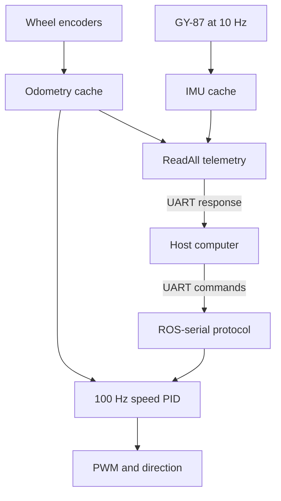

# Lenna Mobile Robot ONE — MCU Firmware

This directory contains the embedded firmware for the **Lenna Mobile Robot ONE (LMR)** Bardia MCU Board. The application runs on an **STM32F407VGT6** and provides the robot's low-level, real-time functions:

- closed-loop speed control for two DC motors;
- quadrature-encoder odometry;
- MPU-6050 and HMC5883L sensor acquisition;
- differential-drive motor output;
- ultrasonic-sensor support;
- command and telemetry exchange with the host computer over UART.

For the board design, schematics, PCB files, and full project documentation, return to the [repository README](../../../../README.md).

## Contents

- [Firmware architecture](#firmware-architecture)
- [Runtime schedule](#runtime-schedule)
- [Project structure](#project-structure)
- [Hardware and peripheral map](#hardware-and-peripheral-map)
- [Modules](#modules)
- [Serial communication](#serial-communication)
- [Build and flash](#build-and-flash)
- [Configuration](#configuration)
- [Real-time design rules](#real-time-design-rules)
- [Debugging](#debugging)
- [Coding conventions](#coding-conventions)
- [License](#license)

## Firmware architecture

The firmware uses STM32 HAL drivers and a cooperative main loop. Hardware interrupts signal time-critical events, while command execution, control updates, and sensor acquisition are performed by application code.



The main data paths are:

1. A host command is received through USART1 or USART2.
2. The protocol handler validates the frame and updates the requested state, such as motor-speed references or PID gains.
3. TIM5 schedules the speed-control loop every 10 ms.
4. The PID module reads both encoders, updates the cached wheel measurements, and calculates the left and right motor commands.
5. The motion module applies direction GPIO states and PWM duty cycles.
6. IMU measurements are acquired separately every tenth control cycle.
7. A `ReadAll` request serializes the most recent cached odometry and IMU values without initiating new sensor reads.

## Runtime schedule

| Activity | Nominal rate | Location | Purpose |
|---|---:|---|---|
| TIM5 scheduler | 100 Hz | `main.c` | Raises the control-loop flag every 10 ms |
| Encoder and PID update | 100 Hz | `pid.c` | Measures wheel speed and updates both motor outputs |
| IMU and magnetometer acquisition | 10 Hz | `main.c`, `imu.c` | Refreshes the cached inertial measurements |
| UART reception | Event-driven | `main.c`, `rosserial.c` | Receives framed host commands using interrupts |
| Telemetry response | On request | `rosserial.c` | Sends the latest cached state |

TIM5 has a higher effective interrupt priority than the UART interfaces. Keep interrupt callbacks short and keep all blocking peripheral operations out of interrupt context.

## Project structure

```text
Lenna-Bardia-MCU-Board/
├── Core/
│   ├── Inc/                         Application and generated headers
│   │   ├── mcu_config.h             Board-level pin and protocol definitions
│   │   ├── motion.h                 Motor and differential-drive API
│   │   ├── odometry.h               Encoder and wheel-state API
│   │   ├── pid.h                    Dual-motor PID API and default gains
│   │   ├── imu.h                    MPU-6050/HMC5883L API
│   │   ├── rosserial.h              UART protocol state and commands
│   │   ├── ultrasonic.h             HC-SR04 API
│   │   └── utilities.h              Timing utilities
│   ├── Src/
│   │   ├── main.c                   Initialization, scheduler, and callbacks
│   │   ├── motion.c                 PWM and direction control
│   │   ├── odometry.c               Encoder processing
│   │   ├── pid.c                    Closed-loop wheel-speed control
│   │   ├── imu.c                    IMU, magnetometer, and filtering
│   │   ├── rosserial.c              Packet validation and dispatch
│   │   ├── ultrasonic.c             Ultrasonic measurement
│   │   └── utilities.c              Microsecond delay support
│   └── Startup/                     STM32 startup assembly
├── Drivers/                         STM32F4 HAL and CMSIS
├── .settings/                       STM32CubeIDE project settings
├── Lenna-Bardia-MCU-Board.ioc       STM32CubeMX configuration
├── STM32F407VGTX_FLASH.ld           Flash linker script
├── STM32F407VGTX_RAM.ld             RAM linker script
└── README.md                        Firmware documentation
```

Files such as `gpio.c`, `tim.c`, `usart.c`, and `i2c.c` are generated from the `.ioc` configuration. Application-specific behavior is concentrated in `main.c` and the `LRL_` modules.

## Hardware and peripheral map

| Peripheral | Assignment | Firmware use |
|---|---|---|
| STM32 | STM32F407VGT6, LQFP100 | Main controller |
| TIM2 | Encoder mode | Left wheel encoder |
| TIM3 | Encoder mode | Right wheel encoder |
| TIM8 CH1 | PWM | Right motor |
| TIM8 CH2 | PWM | Left motor |
| TIM5 | Periodic interrupt | 10 ms control scheduler |
| TIM4 | Input capture | Ultrasonic echo timing |
| TIM1 | Base timer | Microsecond delay utility |
| USART1 | 115200, 8-N-1 | On-board USB-to-serial interface |
| USART2 | 115200, 8-N-1 | Host/Jetson interface |
| I2C3 | 100 kHz | GY-87 IMU and magnetometer |
| ADC1 | Analog input | Battery-level measurement support |

The current differential-drive configuration in `main.c` uses a wheel radius of **32.5 mm**, a wheel separation of **180 mm**, and an encoder period of **48,960 counts**.

## Modules

### Motion control

[`motion.c`](Core/Src/motion.c) converts signed duty-cycle commands into motor direction and PWM output.

| Function | Purpose |
|---|---|
| `LRL_Motion_MotorSpeed()` | Controls one motor from -100% to +100% duty cycle |
| `LRL_Motion_Control()` | Applies independent left and right motor commands |
| `LRL_Motion_MotorTest()` | Runs a blocking motor test sequence for bench testing |

### PID controller

[`pid.c`](Core/Src/pid.c) contains a single controller state with independent gains and internal values for the two wheels. `LRL_PID_Update()` performs the encoder measurement, calculates both control signals, applies saturation, and supports anti-windup.

Default gains, saturation limits, and the 10 ms sampling time are defined in [`pid.h`](Core/Inc/pid.h). Gains can also be changed through the serial protocol.

### Odometry

[`odometry.c`](Core/Src/odometry.c) reads TIM2 and TIM3, handles counter wraparound, calculates signed wheel velocity, and updates incremental wheel distance.

`LRL_Odometry_ReadAngularSpeed()` owns the encoder-history update. During normal closed-loop operation it is called by `LRL_PID_Update()`, and the resulting values in `odom.vel` and `odom.dist` act as the telemetry cache.

### IMU and magnetometer

[`imu.c`](Core/Src/imu.c) supports the GY-87 module:

- MPU-6050 accelerometer and gyroscope initialization;
- accelerometer and gyroscope calibration;
- HMC5883L magnetometer initialization and heading calculation;
- complementary filtering for roll and pitch.

The main loop refreshes the IMU cache at 10 Hz. Communication functions read this cache; they do not perform I2C transactions.

### ROS-serial protocol

[`rosserial.c`](Core/Src/rosserial.c) implements the custom binary protocol used by the host-side ROS integration. Despite the module name, this is a project-specific protocol with ROS-style framing, not the standard ROS `rosserial` client library.

The module supports both configured UART interfaces through separate `rosserial_cfgType` instances.

### Ultrasonic sensors

[`ultrasonic.c`](Core/Src/ultrasonic.c) provides trigger, input-capture, overflow, and distance-reading functions for HC-SR04 sensors. The callbacks are available, but the relevant callback code in `main.c` must be enabled when ultrasonic sensing is used.

### Utilities

[`utilities.c`](Core/Src/utilities.c) provides the timer-backed `LRL_Delay_Us()` helper used for short microsecond delays.

## Serial communication

### Interfaces

| Interface | Handle | Intended connection |
|---|---|---|
| USB-to-serial | `huart1` / USART1 | Development computer |
| Host serial | `huart2` / USART2 | Jetson or another high-level controller |

Both interfaces use **115200 baud, 8 data bits, no parity, and 1 stop bit**.

### Frame format

| Byte(s) | Field | Description |
|---|---|---|
| 0 | Sync 1 | `0xFF` |
| 1 | Protocol version / Sync 2 | `0xFE` |
| 2–3 | Payload length | 16-bit little-endian length |
| 4 | Header checksum | Validates the length field |
| 5–6 | Function ID | Two-byte command identifier; current dispatch uses the low byte |
| 7…N | Command data | Function-specific payload |
| Last | Data checksum | Validates the function ID and data |

### Commands

| ID | Command | MCU behavior |
|---:|---|---|
| `0x00` | Query | Echoes the received frame for a link test |
| `0x01` | ReadAll | Returns cached wheel, IMU, and heading data |
| `0x02` | SetPID | Updates left or right PID gains |
| `0x03` | GetPID | Returns the selected motor's PID gains |
| `0x04` | MotorSpeed | Updates the signed left and right wheel-speed references |

The protocol parser validates sync bytes and both checksums. Invalid frames generate an error response. Refer to the header comment in [`rosserial.c`](Core/Src/rosserial.c) for byte-level examples.

## Build and flash

### Requirements

- STM32CubeIDE;
- an ST-LINK programmer/debugger;
- the Bardia MCU Board or equivalent STM32F407VGT6 target;
- a suitable board power supply;
- optional serial terminal for communication tests.

The repository already contains the STM32 HAL and CMSIS dependencies under `Drivers/`; no separate package installation is required.

### STM32CubeIDE workflow

1. Clone the repository:

   ```bash
   git clone https://github.com/Lenna-Robotics-Research-Lab/LMRO-MCU-Board.git
   ```

2. In STM32CubeIDE, select **File → Open Projects from File System**.
3. Select this `Lenna-Bardia-MCU-Board` directory as the project root.
4. Allow STM32CubeIDE to import the existing project configuration.
5. Select the **Debug** or **Release** build configuration and build the project.
6. Connect ST-LINK to SWDIO, SWCLK, GND, and the appropriate reference voltage.
7. Use **Run** or **Debug** to program the MCU.

Before connecting motors, verify the supply voltage, motor wiring, encoder wiring, and direction convention. For initial tests, keep the wheels raised or mechanically unloaded and ensure an emergency power-disconnect method is available.

## Configuration

| Setting | Location |
|---|---|
| Board GPIO and basic protocol constants | [`mcu_config.h`](Core/Inc/mcu_config.h) |
| MCU pins, clocks, timers, and peripheral generation | [`Lenna-Bardia-MCU-Board.ioc`](Lenna-Bardia-MCU-Board.ioc) |
| Motor mapping and robot geometry | [`main.c`](Core/Src/main.c) |
| PID gains, limits, and sample time | [`pid.h`](Core/Inc/pid.h) |
| UART selection and protocol limits | [`rosserial.h`](Core/Inc/rosserial.h) |
| IMU addresses, ranges, and filter constants | [`imu.h`](Core/Inc/imu.h) |

When regenerating code with STM32CubeMX, keep application changes inside the generated `USER CODE BEGIN` / `USER CODE END` sections. Review the generated interrupt priorities after regeneration.

## Real-time design rules

These rules are essential for stable motor control:

1. **The PID loop owns encoder sampling.** During closed-loop operation, only `LRL_PID_Update()` should call `LRL_Odometry_ReadAngularSpeed()`. Other modules consume the cached values.
2. **`ReadAll` must remain read-only with respect to sensors.** It may copy cached `odom` and `imu` fields, build a packet, and transmit it. Do not add `LRL_IMU_MPUReadAll()`, `LRL_IMU_MagReadHeading()`, or a new odometry measurement to this function.
3. **Do not perform blocking I2C work in UART callbacks.** Blocking sensor reads can delay the 10 ms control schedule and produce visible motor-speed jumps.
4. **Keep interrupt callbacks short.** Receive or store data, update a flag, and return. Perform packet dispatch and peripheral work in the main loop.
5. **Keep telemetry transmission asynchronous where practical.** `ReadAll` currently uses `HAL_UART_Transmit_IT()` so the 34-byte response does not block the controller for the full wire time.
6. **Preserve priority ordering.** TIM5 must be able to pre-empt UART handling. The application sets TIM5 to priority 1 and USART2 to priority 2; lower numbers represent higher urgency on STM32.
7. **Keep scheduled work bounded.** `pid_tim_flag` is a binary flag, so a main-loop operation that lasts longer than one 10 ms period can collapse multiple timer events into one update.

The intended ownership model is:

```text
PID update:  encoders -> odometry cache -> controller -> motor output
IMU task:    I2C sensors -> IMU cache
ReadAll:     odometry cache + IMU cache -> UART packet
```

## Debugging

### Motors jump when telemetry is requested

Check that `LRL_ROSSerial_ReadAll()` only packages cached fields. Fresh I2C or encoder acquisition in the telemetry path disturbs the controller timing.

### Motors do not move

- Confirm that TIM8 PWM channels are started.
- Confirm that a non-zero speed reference was received.
- Inspect `mypid.Ref_Vel_l`, `mypid.Ref_Vel_r`, and both control signals.
- Verify motor direction GPIOs and the external power supply.

### Wheel speed is incorrect or reversed

- Verify that TIM2 is connected to the left encoder and TIM3 to the right encoder.
- Check the encoder channel polarity and wiring.
- Confirm `MAX_ARR`, `TICK2RPM`, and the left/right direction conventions.

### Serial commands are ignored

- Confirm 115200, 8-N-1 on the host.
- Verify that the frame starts with `0xFF 0xFE`.
- Check the header and data checksums.
- Confirm that the host is connected to the intended UART.
- Inspect `err_hdl`, `packetReceived`, `headerValid`, and `dataValid`.

### IMU values do not update

- Verify the GY-87 connection to I2C3.
- Confirm sensor addresses and pull-up resistors.
- Check HAL return values during initialization and reads.
- Ensure the 10 Hz acquisition block remains enabled in `main.c`.

## Coding conventions

- Public laboratory functions use the `LRL_<Module>_<Function>` naming pattern.
- Module headers live in `Core/Inc`; implementations live in `Core/Src`.
- Configuration structures commonly use the `_cfgType` suffix; state structures use `_statetype`.
- Constants and macros use uppercase names with underscores.
- Internal module helpers may begin with an underscore, such as `_LRL_Clear_Buffer()`.
- Public functions and modules should use Doxygen-compatible comments.
- Hardware mappings belong in `mcu_config.h`, `main.h`, or the `.ioc` file rather than being duplicated throughout the application.

## License

This firmware is distributed under the repository's [GNU General Public License v3.0](../../../../LICENSE).
