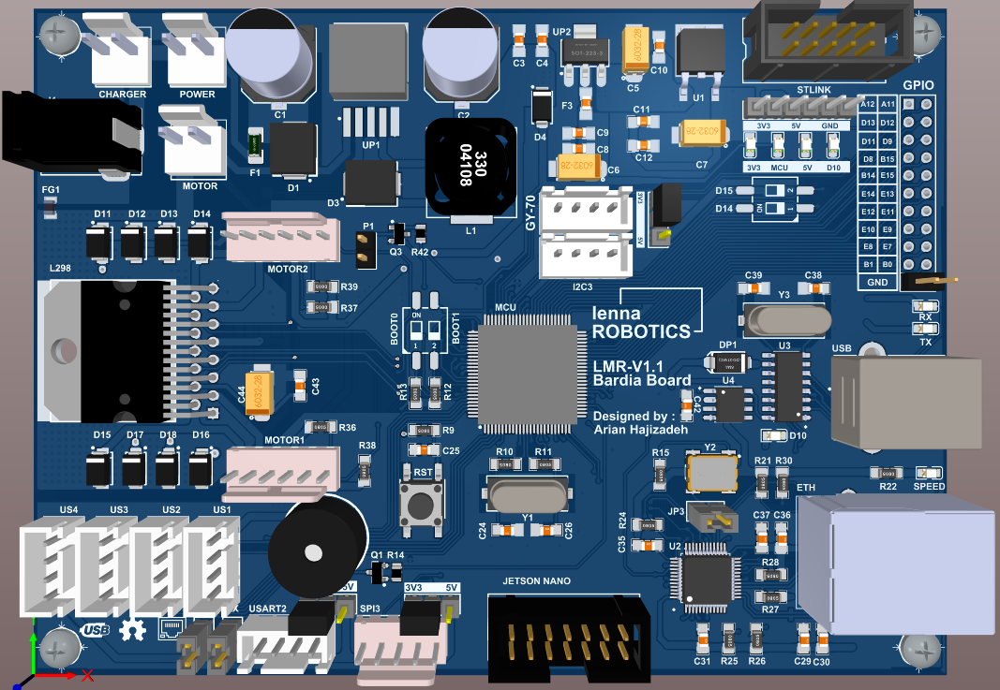
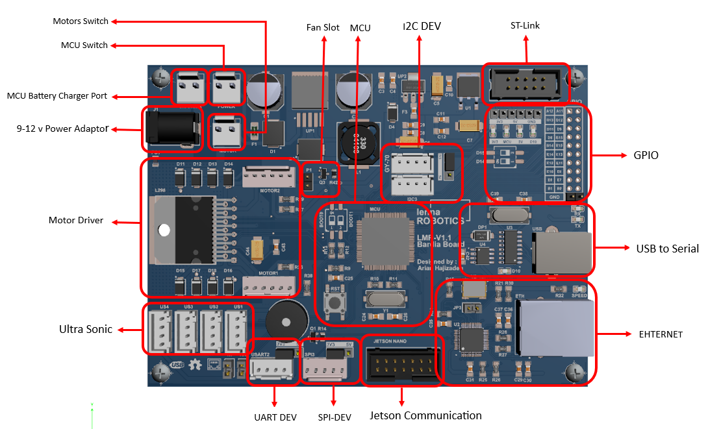
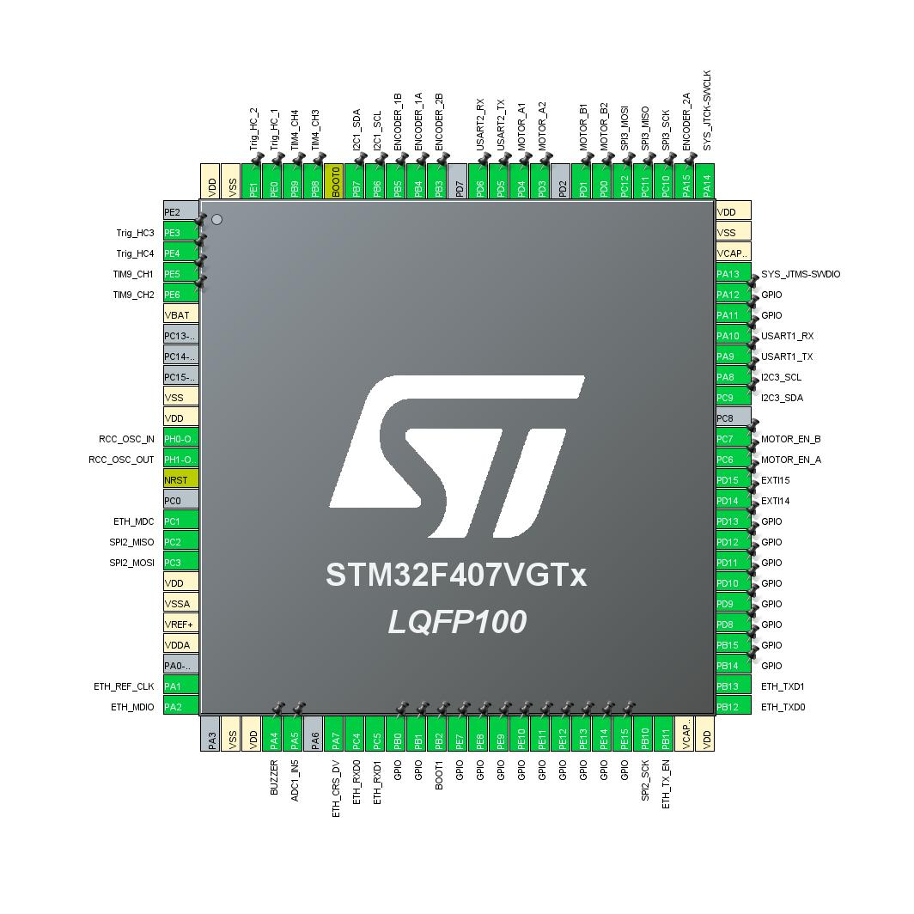

# LMR Bardia MCU Board

Open-source control electronics and embedded software for the **Lenna Mobile Robot ONE (LMR v1.1)**, developed by [Lenna Robotics Research Lab](https://github.com/Lenna-Robotics-Research-Lab).

The Bardia board is built around the STM32F407VGT6 and combines motor control, encoder feedback, sensor interfaces, power management, and host-computer communication on one mobile-robotics platform.

<p align="center">
  
  
</p>

## Contents

- [Main features](#main-features)
- [Quick navigation](#quick-navigation)
- [Repository structure](#repository-structure)
- [Hardware overview](#hardware-overview)
- [Embedded software](#embedded-software)
- [Motor identification and control](#motor-identification-and-control)
- [Host communication](#host-communication)
- [Getting started](#getting-started)
- [License](#license)

## Main features

- STM32F407VGT6 Arm Cortex-M4 microcontroller
- On-board L298 dual H-bridge motor driver
- Quadrature encoder inputs for closed-loop wheel-speed control
- CH340G USB-to-serial interface
- Simultaneous USB and battery connection through the power-management circuit
- Dedicated battery-voltage ADC input
- Dedicated cooling-fan connector
- Four HC-SR04-compatible ultrasonic sensor connectors
- Expansion interfaces:
  - 1x I2C
  - 1x UART
  - 1x SPI
  - 1x CAN
  - 20x GPIO
- Ethernet hardware based on the DP83848 physical-layer transceiver

> [!NOTE]
> Ethernet hardware is present on the board, but Ethernet is not used in the initial LMR v1.1 software release.

## Quick navigation

| Area | Location | Description |
| --- | --- | --- |
| Datasheets | [`1-Resources/1-Datasheets`](./1-Resources/1-Datasheets) | Component datasheets and hardware design references |
| MATLAB simulation | [`2-Design/2-Simulation/MATLAB`](./2-Design/2-Simulation/MATLAB) | Kinematic modelling and motor system identification |
| Altium hardware project | [`2-Design/3-Detailed-Design/1-Electronics/LMR_V1`](./2-Design/3-Detailed-Design/1-Electronics/LMR_V1) | Schematics, PCB layout, and 3D board files |
| STM32 firmware | [`2-Design/3-Detailed-Design/2-Source-Code/Lenna-Bardia-MCU-Board`](./2-Design/3-Detailed-Design/2-Source-Code/Lenna-Bardia-MCU-Board) | STM32CubeIDE project and embedded-software documentation |
| Board figures | [`3-Documentation/3-Figures`](./3-Documentation/3-Figures) | Board photographs, renders, and pinout diagram |
| License | [`LICENSE`](./LICENSE) | Repository license |

## Repository structure

The following tree shows the main project areas. Generated STM32 support files and individual datasheets are omitted for readability.

```text
LMRO-MCU-Board/
├── 1-Resources/
│   └── 1-Datasheets/                 # Component datasheets and references
├── 2-Design/
│   ├── 2-Simulation/
│   │   └── MATLAB/
│   │       ├── Kinematics-Modeling/  # Differential-drive modelling
│   │       └── System-Identification/# Motor identification and control models
│   └── 3-Detailed-Design/
│       ├── 1-Electronics/
│       │   └── LMR_V1/               # Altium schematics, PCB, and 3D models
│       └── 2-Source-Code/
│           └── Lenna-Bardia-MCU-Board/
│               ├── Core/
│               │   ├── Inc/          # Application headers
│               │   ├── Src/          # Application sources
│               │   └── Startup/      # STM32 startup code
│               ├── Drivers/          # STM32 HAL and CMSIS drivers
│               ├── Lenna-Bardia-MCU-Board.ioc
│               └── README.md         # Detailed firmware documentation
├── 3-Documentation/
│   └── 3-Figures/                    # Board images and pinout
├── LICENSE
└── README.md
```

## Hardware overview

### Microcontroller

The STM32F407VGT6 is the central controller of the Bardia board. It was selected for its processing capability, timer resources, encoder support, communication peripherals, Ethernet capability, availability, and cost.

Its peripherals allow the board to connect directly to the robot's motor driver, wheel encoders, IMU, ultrasonic sensors, battery monitor, and high-level computer.

### Motor driver

The on-board L298 dual H-bridge can drive the two DC motors used by the LMR v1.1 differential-drive base. The motor-control firmware generates PWM and direction signals, while the wheel encoders provide feedback to the PID speed controller.

For robots that require additional motors, higher current, or greater precision, an external motor-driver board is recommended.

Noise-reduction measures include:

- **Single-point ground connection:** the motor-driver ground and logic ground are joined at one point through a ferrite bead.
- **EMI reduction:** ground stitching is used around the motor-driver section of the PCB.

### USB-to-serial interface

The USB Type-B connector and CH340G interface provide a direct serial connection to a computer. This connection can be used for debugging, telemetry, and MATLAB/Octave-based experiments. USB can also power the logic circuitry when motor power is not required.

### Power management

The board supports either:

- a three-cell lithium-ion battery pack with an integrated BMS (12.6 V fully charged, 2200 mAh in the original robot); or
- a 5 V USB supply when the motors are not needed.

The power-management circuit allows the battery and USB connection to remain attached simultaneously.

### Board layout

The board pinout and connector assignments are shown below.



## Embedded software

The STM32 firmware is the low-level control system for the robot. It handles motor actuation, encoder feedback, odometry, IMU acquisition, ultrasonic sensing, battery monitoring, and serial communication with the high-level computer.

The complete STM32CubeIDE project and detailed module documentation are available in the [firmware directory](./2-Design/3-Detailed-Design/2-Source-Code/Lenna-Bardia-MCU-Board).

### Main firmware modules

| Module | Purpose |
| --- | --- |
| `main.c` | Peripheral initialization and application scheduling |
| `motion.c` / `motion.h` | PWM and direction control for the differential-drive motors |
| `pid.c` / `pid.h` | Closed-loop wheel-speed PID controller |
| `odometry.c` / `odometry.h` | Encoder processing, wheel speed, and travelled-distance calculation |
| `imu.c` / `imu.h` | MPU-6050 and HMC5883L acquisition, calibration, and orientation estimation |
| `rosserial.c` / `rosserial.h` | Custom UART packet handling for commands and telemetry |
| `ultrasonic.c` / `ultrasonic.h` | HC-SR04 trigger, echo capture, and distance measurement |
| `mcu_config.h` | Central hardware and application configuration |
| `utilities.c` / `utilities.h` | Shared timing and helper functions |

> [!IMPORTANT]
> Public functions developed by Lenna Robotics Research Lab use the `LRL_` prefix. Private module functions may use a leading underscore, such as `_LRL_...`.

## Motor identification and control

The two ZGA25 motors can respond differently even when they share the same part number and receive the same input. Closed-loop control is therefore required to obtain consistent wheel speeds.

The controller-development workflow uses:

1. the board's USB-to-serial interface to exchange experiment data;
2. MATLAB/Simulink Desktop Real-Time for motor system identification;
3. the identified motor response to support controller design; and
4. an embedded PID controller with encoder feedback to regulate each wheel speed.

The related models are available in [`2-Design/2-Simulation/MATLAB`](./2-Design/2-Simulation/MATLAB).

## IMU

The robot uses a GY-87 module connected through I2C. The module combines an MPU-6050 accelerometer/gyroscope with an HMC5883L magnetometer. Magnetometer data provides an external heading reference that helps reduce yaw drift compared with gyroscope-only estimation.

The firmware provides dedicated initialization, calibration, sensor-reading, and complementary-filter functions in `imu.c` and `imu.h`.

## Host communication

The Bardia board communicates with the robot's high-level computer through UART. The original LMR v1.1 integration used a Jetson Nano; the interface can also be used with another compatible Jetson or Linux host.

A custom Lenna Robotics Research Lab packet protocol carries:

- wheel-speed commands from the host to the MCU; and
- encoder, odometry, IMU, ultrasonic, and board-status telemetry from the MCU to the host.

Low-level control remains on the STM32, while perception, navigation, and other computationally intensive tasks run on the high-level computer.

## Getting started

### Explore the hardware

1. Open [`LMR_V1.PrjPcb`](./2-Design/3-Detailed-Design/1-Electronics/LMR_V1/LMR_V1.PrjPcb) in Altium Designer.
2. Review the individual schematic sheets before connecting external hardware.
3. Use the [board layout](#board-layout) to verify connector pin assignments.

### Build the firmware

1. Install STM32CubeIDE.
2. Import the project from [`2-Design/3-Detailed-Design/2-Source-Code/Lenna-Bardia-MCU-Board`](./2-Design/3-Detailed-Design/2-Source-Code/Lenna-Bardia-MCU-Board).
3. Review the board configuration in `Lenna-Bardia-MCU-Board.ioc` and `Core/Inc/mcu_config.h`.
4. Build the project and flash the STM32F407VGT6 using an ST-LINK-compatible programmer.
5. Read the [firmware README](./2-Design/3-Detailed-Design/2-Source-Code/Lenna-Bardia-MCU-Board/README.md) for module-level details.

> [!CAUTION]
> Verify the supply voltage, motor wiring, encoder wiring, and connector pinout before powering the motors. USB power alone is intended for the logic circuitry, not for driving the motors.

## License

This repository is distributed under the terms in [`LICENSE`](./LICENSE).
